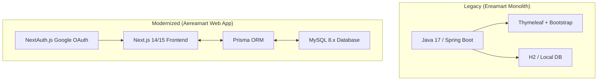

# Aereamart 🛒

🌐 **Website:** [aereamart.com](https://aereamart.com)

Welcome to the **Aereamart** GitHub organization! Aereamart is a modern, next-generation enterprise resource planning (ERP) and e-commerce platform. It is designed to streamline retail operations, customer engagement, procurement, inventory logistics, and financial workflows.

---

## 🌟 Overview & Mission

Aereamart is the modernization and migration of **Ereamart**—a legacy Spring Boot monolith—into a responsive, high-performance web application suite. Our goal is to split the system into a decoupled frontend and backend architecture while retaining and optimizing core business pipelines.

### Legacy vs. Modern Stack



---

## 📂 Active Repositories

| Repository | Purpose | Primary Tech Stack |
| :--- | :--- | :--- |
| [**`web-app-frontend`**](https://github.com/aereamart/web-app-frontend) | Client application containing the POS interface, admin dashboard, and CRUD modules. | Next.js, TypeScript, Tailwind CSS, shadcn/ui |
| [**`web-app-backend`**](https://github.com/aereamart/web-app-backend) | API services, data access layer, business logic engine, and database migrations. | Node.js, Express.js, Prisma ORM, MySQL |

---

## 🏗️ Architecture & Technology Stack

The migrated web app architecture uses modern web standards to ensure premium performance and a state-of-the-art user experience:

*   **Frontend**: Built with **Next.js App Router**, **TypeScript**, and styled using **Tailwind CSS** with **shadcn/ui** design tokens. Custom interactive controls (such as TanStack Table and Chart.js) provide real-time dashboard visualization.
*   **Backend**: Node.js + Express API services configured with **Prisma ORM** for type-safe database queries.
*   **Database**: **MySQL 8.0+** hosting relational tables for customers, suppliers, inventory batches, and transactions.
*   **Authentication & Security**: Managed via **NextAuth.js** leveraging **Google OAuth** only. Role-Based Access Control (RBAC) maps permissions from the database directly onto user sessions.

---

## ⚙️ Core Business Logic

Aereamart enforces several real-world business workflows automated via database transactions:

### 1. FIFO Inventory Deduction
When a sales invoice is created, inventory is deducted using a First-In, First-Out (FIFO) strategy based on batch expiry dates.

### 2. GRN → Expenses Pipeline
Saving an active Goods Received Note (GRN) automatically triggers downstream accounting — products are added to inventory and a corresponding expense record is generated.

### 3. Invoice → Income Pipeline
Completing an invoice checkout at the POS terminal auto-generates an income record and processes loyalty points.

### 4. Employee → User Auto-Creation
When an administrator creates a new Employee with a designation that has the `useraccount` toggle enabled, a user account is automatically created and mapped to the designated role.

---

## 🔐 Role-Based Access Control (RBAC)

System privileges are granularly mapped to four organizational roles:

| Role | Module Access |
| :--- | :--- |
| **Admin** | All Modules (Full Access) |
| **Manager** | Inventory, Orders, Products, Customers |
| **Cashier** | POS / Invoices, Customers, Income |
| **Accountant** | Expenses, Income, Financial Reports |

---

## 🚀 Getting Started

1.  **Clone the repositories**:
```bash
git clone https://github.com/aereamart/web-app-backend.git
git clone https://github.com/aereamart/web-app-frontend.git
```
2.  **Setup Environment Variables**:
Configure Google OAuth credentials and the database connection URI in the backend `.env` file (see `.env.example`).
3.  **Database Migration & Seeding**:
Run Prisma migrations and seed lookup tables:
```bash
   cd web-app-backend
   npm install
   npx prisma migrate dev
   npx prisma db seed
   ```
4.  **Launch Frontend**:
```bash
   cd ../web-app-frontend
   npm install
   npm run dev
   ```
